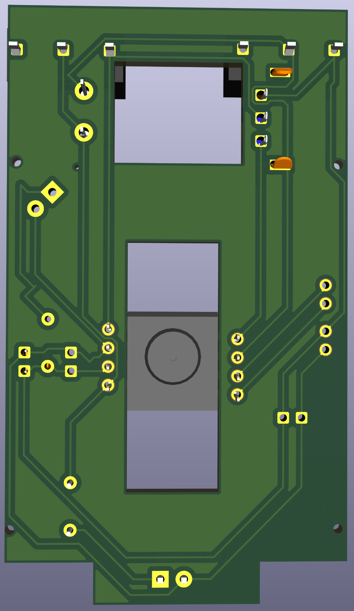
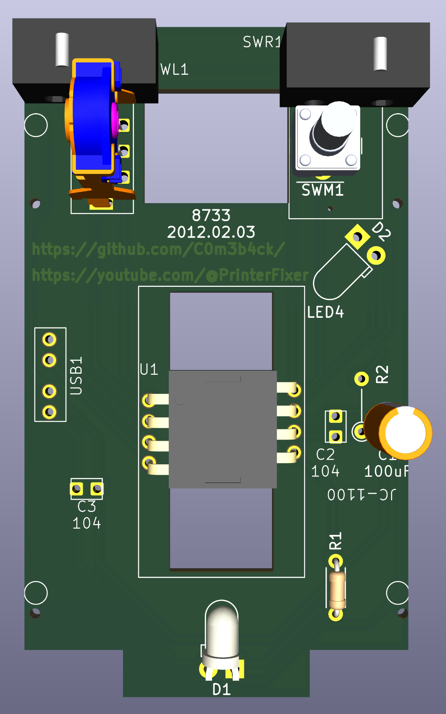
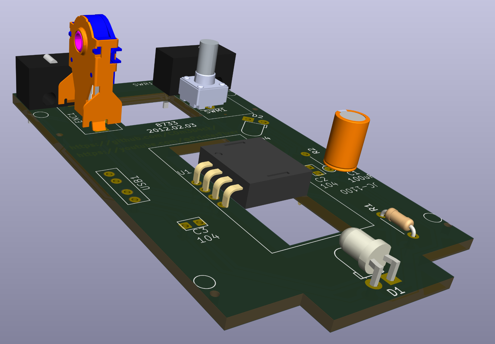
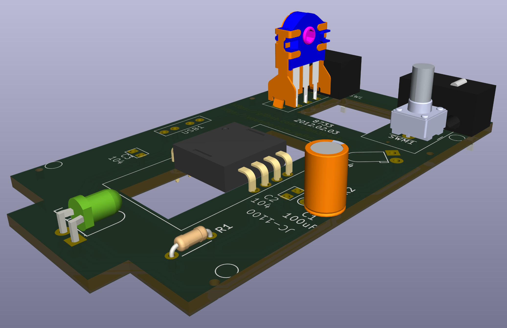
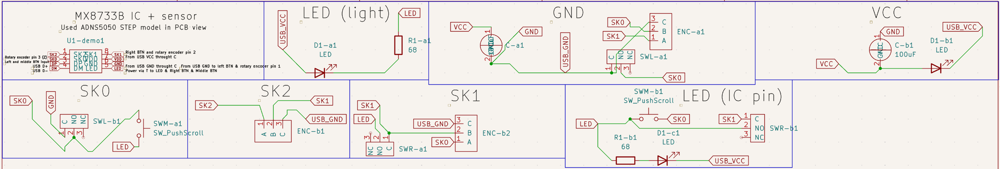
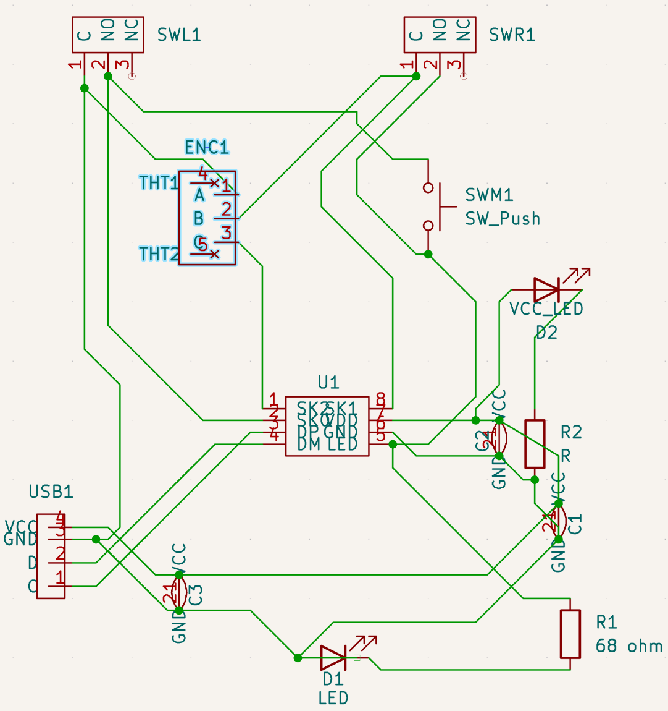

# XM102K Mouse in KiCAD 
[@PrinterFixer](https://www.youtube.com/@PrinterFixer)
[Video title here](VIDEO HERE - IF THERE IS NONE THEN IT IS NOT DONE)

KiCAD project with GERBER and DRILL files of the XM102K mouse PCB from 2012/02/03, remade manually by me, C0m3b4ck. All models of all components are in place, the PCB is of accurate size. The only inacurracies are the connections, which aren't 1:1 to the actual PCB. The microswitch and the rotary encoder are the exact same but from different companies (couldn't find original companies).

**The mouse PCB is from 2012/02/03. It is end-of-life and comes from an unknown Chinese manufacturer.** 

## Capabilities
**From the MX8733B documentation:**
* Optical Navigation Technology
* Universal Serial Bus Specification, version 2.0
* USB HID Specification, version 1.1
* USB-IF and WHQL compliable
* 5V Power Supply
* Power saving during no motion
* On chip LED drive with regulated current
* Crystal-less
* 1000CPI resolution (Counts per Inch)
* Low electromagnetic inference radiation
* Supports 3D (X, Y, Z) input
* Supports 3 buttons and mechanical wheel encoding

## GERBER, DRILL and BOM (click to download)
* [Full labelling and components](https://github.com/C0m3b4ck/XM102K-Mouse/blob/main/XM102K-GERBER-DRILL-FULL.7z)
* [Only soldered compoenents](https://github.com/C0m3b4ck/XM102K-Mouse/blob/main/XM102K-GERBER-DRILL.7z)
* [Bill of Materials in .CSV](https://github.com/C0m3b4ck/XM102K-Mouse/blob/main/XM102K-BOM.csv)
## Components:
* MX8733B IC - [documentation included](https://github.com/C0m3b4ck/XM102K-Mouse/blob/main/DOCS/MX8733B.pdf),
* Illinois KXM Capacitor 100uf - [documentation included](https://github.com/C0m3b4ck/XM102K-Mouse/blob/main/DOCS/Omron-D2F-01-A-datasheet.pdf),
* 68ohm resistor,
* Omron D2F-01 microswitch - [documentation included](https://github.com/C0m3b4ck/XM102K-Mouse/blob/main/DOCS/Omron-D2F-01-A-datasheet.pdf) (same as on PCB but from a different company),
* 2-pin LED,
* 3-pin AlpsAlpine Rotary Encoder,

## Repository layout

- `DOCS/` — component datasheets and board photos.
- mouse1/mouse1/mouse1-1/mouse1-1.kicad_pro - project file.
- `XM102K-GERBER-DRILL.7z` — archived Gerber/drill package.
- `Xtreme-XM102K/` — KiCAD project files - models, footprints, symbols, schematic and PCB.

## Images
| | | | |
|---|---|---|---|
| 
 PCB 3D view in KiCAD - underside.
 | 
 PCB 3D view in KiCAD - top view.
 | 
 PCB 3D view in KiCAD - left.
 | 
 PCB 3D view in KiCAD - right.
 |
| 
 The underside of the PCB.
 | 
 View of the PCB from top.
 | 
 View of the PCB from the left.
 | 
 View of the PCB from the right.
 |
| 
 The mouse case, stock photo.
 | 
 Full mouse case and cable view from top.
 |  |  |
| 
 Schematic divided into sections.
 | 
 Schematic of full circuit.
 |  |  |

## Credits

**Project made manually by me on 7/07/2026.**
* Alpine Rotary Encoder from [AlpsAlpine](https://www.alpsalpine.com/j/)
* D2F-01 microswitch from [Omron](https://www.omron.com/global/en/),
* KXM Capacitor from Illinois capacitor (website shut down),
* MX8733B mouse chip from [Shenzhen LIZE Electronic Technology Co., Ltd](http://www.lizhiic.com/)

## Purpose

This repository preserves the complete investigation of the XM102K mouse hardware: project files, documentation and images.
It is intended as a technical reference for anyone analyzing, repairing, or getting inspired by the XM102K design and the MX8733B-based optical mouse architecture.
